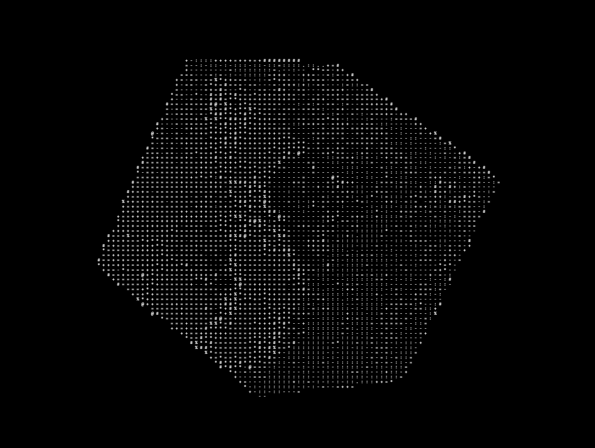

<h1 align="center">
  <br>
  
  <br>
  Cogito Ergo Sum Pentest Framework
  <br>
</h1>

<h4 align="center">Advanced AI-Powered Penetration Testing Framework</h4>
<h3 align="center">"I Scan, Therefore I Secure" - AI-Powered Offensive Security Toolkit</h3>

<div align="center">

[](https://www.python.org/)
[](LICENSE)
[](#cogito-ergo-sum-pentest-framework)
[](#-ai-integration-setup)
[](#-features)
[](#cogito-ergo-sum-pentest-framework)
[](#cogito-ergo-sum-pentest-framework)

</div>


## ✨ Features

### 🛡️ Multi-Module Architecture
- **Web Vulnerability Scanner**
  - SQL injection detection
  - XSS payload validation
  - Business logic flaw analysis
  - CSRF token detection

- **Intelligent Directory Brute-forcer**
  - Multi-process architecture
  - Dynamic timeout handling
  - Custom wordlist support
  - Progress visualization

- **AI Assistant Integration**
  - DeepSeek LLM integration
  - Vulnerability explanation
  - Attack vector suggestions
  - Report generation

### ⚡ Advanced Capabilities
```plaintext
• Parallel scanning engine (threads/processes hybrid)
• Technology fingerprinting (Wappalyzer integration)
• API security testing (GraphQL/REST validation)
• Multi-format reporting (HTML/JSON/CSV/PDF)
```

## 🚀 Installation

### Requirements
- Python 3.8+

### Quick Start
```bash
# Clone repository
git clone https://github.com/oliviaisntcringe/CES_framework.git
cd CES_framework

# Install dependencies
chmod +x install.sh
./install.sh

# Launch framework
source venv/bin/activate
python3 CES.py
```

### Virtual Environment (Recommended)
```bash
python3 -m venv ces-env
source ces-env/bin/activate
pip install --upgrade pip wheel
```

## 🤖 AI Integration Setup


1. **Get Authentication Token:**
   ```bash
   1. Visit https://chat.deepseek.com
   2. Login to your account
   3. Open DevTools (F12)
   4. Navigate to: Application → Local Storage → userToken
   5. Copy the token value
   ```

2. **Configure Framework:**
   ```python
   # AMAI.py
     from dsk.api import DeepSeekAPI
     # Initialize with your auth token
     api = DeepSeekAPI("PUT YOUR API KEY")
   ```

## 🕹️ Basic Usage

### Framework Interface
```bash
# Start main console
python3 CES.py

CES > show scanners
CES > use webscan
CES/webscan > set target http://example.com
CES/webscan > show options
CES/webscan > run
```

### Command Cheatsheet
| Command | Description | Example |
|---------|-------------|---------|
| `show modules` | List available scanners | `show scanners` |
| `use <module>` | Select module | `use webscan` |
| `set <param>` | Configure option | `set threads 20` |
| `ai` | Ask AI assistant | `ai` |

## ⚙️ Configuration

### config.yaml Example
```yaml
core:
  threads: 15
  processes: 4
  timeout: 7.5
  output_format: "html"
  report_dir: "./reports"

webscan:
  wordlists:
    directories: "/wordlists/general.txt"
    payloads: "/wordlists/xss-payloads.txt"
  risk_level: 3
  crawl_depth: 5
```

## 🌟 Roadmap

### Q3 2024
- [ ] Automated Exploit Generation
- [ ] GraphQL Attack Surface Mapping
- [ ] CI/CD Pipeline Scanner

### Q4 2024
- [ ] Zero-Day Exploit Database
- [ ] AI-Powered Fuzzing Engine
- [ ] Dark Web Monitoring Module

## 📜 License

This project is licensed under the GNU GPLv3 License - see the [LICENSE](LICENSE) file for details.

> **Warning**  
> This tool should only be used on systems with explicit permission. Unauthorized testing is illegal.

---

<p align="center">
  Made with ❤️ by tuerleprince • Support: glebbichivin@yandex.ru
</p>
